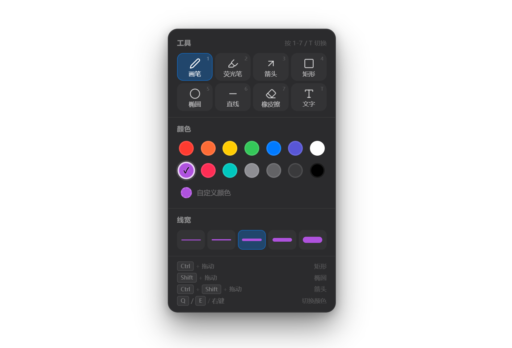

#  MarkerOn

> **轻量级屏幕标注工具** — 按下快捷键，随时在桌面上自由绘画、标注。适用于课堂演示 / 会议讲解 / 录屏批注。

<p align="center">
  
</p>

## 📥 下载安装

<a href="https://get.microsoft.com/installer/download/9n6623x973jv?referrer=appbadge" target="_self" >

</a>

| 平台 | 安装包 | 说明 |
| :--- | :--- | :--- |
| Windows x64 | [MarkerOn_0.0.10_x64-setup.exe](https://github.com/ifer47/markeron/releases/download/v0.0.10/MarkerOn_0.0.10_x64-setup.exe) | NSIS 安装程序（推荐） |
| Windows x64 | [MarkerOn_0.0.10_x64_zh-CN.msi](https://github.com/ifer47/markeron/releases/download/v0.0.10/MarkerOn_0.0.10_x64_zh-CN.msi) | MSI 安装程序 |
| macOS x64 | [MarkerOn_0.0.9_x64.dmg](https://github.com/ifer47/markeron/releases/download/v0.0.9/MarkerOn_0.0.9_x64.dmg) | DMG，打开后拖入「应用程序」。Apple 芯片 Mac 首次运行需在「显示简介」中勾选 **使用 Rosetta 打开**（若系统提示） |

也可以前往 [Releases 页面](https://github.com/ifer47/markeron/releases/tag/v0.0.10) 查看所有版本及更新日志。

## 🚀 快速开始

```bash
# 安装依赖
npm install

# 启动开发模式
npm run dev

# 打包构建（生成安装包）
npm run build
```

启动后应用静默运行在 **系统托盘**，不会弹出任何窗口。

## ⌨️ 快捷键一览

### 全局快捷键

> 以下快捷键在任何界面下都可使用：

| 快捷键 | 功能 |
| :--- | :--- |
| <kbd>Ctrl</kbd> + <kbd>Shift</kbd> + <kbd>D</kbd> | 开启 / 退出标注模式 |
| <kbd>Ctrl</kbd> + <kbd>Shift</kbd> + <kbd>C</kbd> | 清除所有标注 |

### 标注模式 — 绘制

> 进入标注模式后，通过修饰键 + 鼠标拖动快速绘制不同图形：

| 操作 | 绘制内容 |
| :--- | :--- |
| 直接拖动鼠标 | 当前工具（默认画笔） |
| <kbd>Ctrl</kbd> + 拖动 | 矩形 |
| <kbd>Ctrl</kbd> + <kbd>Alt</kbd> + 拖动 | 正方形 |
| <kbd>Shift</kbd> + 拖动 | 椭圆 |
| <kbd>Shift</kbd> + <kbd>Alt</kbd> + 拖动 | 正圆 |
| <kbd>Ctrl</kbd> + <kbd>Shift</kbd> + 拖动 | 箭头 |

### 标注模式 — 编辑与移动

> 绘制完成后，无需切换工具即可直接移动或重新编辑已有元素：

| 操作 | 功能 |
| :--- | :--- |
| 鼠标悬停在已有元素上并拖动 | **移动**该元素（支持所有形状、线条和文字，需在设置中开启"允许拖拽已有元素"） |
| 双击已有文字 | 重新进入该文字的**编辑模式** |
| <kbd>T</kbd> 模式下双击空白处 | 在光标位置新建文字输入框 |

### 标注模式 — 工具切换

> 按数字键即时切换，无需打开面板：

| 按键 | 工具 | 说明 |
| :---: | :--- | :--- |
| <kbd>1</kbd> | ∕ 画笔 | 自由绘画，平滑曲线 |
| <kbd>2</kbd> | ∕∕ 荧光笔 | 半透明高亮标记 |
| <kbd>3</kbd> | ⤤ 箭头 | 带箭头的指示线 |
| <kbd>4</kbd> | ▢ 矩形 | 矩形边框 |
| <kbd>5</kbd> | ○ 椭圆 | 椭圆边框 |
| <kbd>6</kbd> | ╱ 直线 | 直线段 |
| <kbd>7</kbd> | ◎ 橡皮擦 | 实时擦除标注内容，擦除效果跟随元素拖拽 |
| <kbd>T</kbd> | 𝐓 文字 | 双击放置/编辑文字，滚轮调整字号，<kbd>Ctrl</kbd> + <kbd>Enter</kbd> 确认 |

### 标注模式 — 颜色切换

> 彩色光标实时显示当前画笔颜色，切换颜色后底部会短暂提示颜色名称。

| 操作 | 功能 |
| :--- | :--- |
| <kbd>Q</kbd> | 切换到上一个颜色 |
| <kbd>E</kbd> | 切换到下一个颜色 |
| 鼠标右键 | 在光标处弹出快速选色盘（支持 <kbd>Q</kbd> / <kbd>E</kbd> 切换） |

### 标注模式 — 其他操作

| 快捷键 | 功能 |
| :--- | :--- |
| <kbd>Space</kbd> | 呼出 / 隐藏设置面板（工具、颜色、线宽） |
| <kbd>Ctrl</kbd> + <kbd>C</kbd> | 复制屏幕到剪贴板（桌面 + 标注内容） |
| <kbd>Ctrl</kbd> + <kbd>Z</kbd> | 撤销 |
| <kbd>Ctrl</kbd> + <kbd>Shift</kbd> + <kbd>Z</kbd> / <kbd>Ctrl</kbd> + <kbd>Y</kbd> | 重做 |
| <kbd>Delete</kbd> | 清除全部标注（可通过 <kbd>Ctrl</kbd> + <kbd>Z</kbd> 撤销恢复） |
| <kbd>Esc</kbd> | 退出标注模式 |
| <kbd>Alt</kbd> + <kbd>Tab</kbd> | 切换窗口并退出标注模式 |
| <kbd>Win</kbd> | 打开开始菜单并退出标注模式 |

> 💡 标注覆盖全屏（包括任务栏区域），退出标注模式时会自动清除所有绘制内容。

### 设置窗口

右键点击系统托盘图标 → **设置**，即可打开设置窗口。

**常规**

| 选项 | 说明 |
| :--- | :--- |
| 开机自动启动 | 开启后，系统启动时应用会自动在后台静默运行 |
| 允许拖拽已有元素 | 开启后，可通过鼠标拖动已绘制的图形和文字（默认关闭，避免绘图时误触） |

**快捷键**

点击「修改」后按下新的组合键（需含 Ctrl / Alt / Shift 中至少一个，或使用 F1-F12），快捷键即时生效自动保存。若新快捷键与其他应用冲突，会自动回滚并提示。

## 🛠️ 技术栈

| 技术 | 用途 |
| :--- | :--- |
| **Tauri v2** | 桌面应用框架 — Rust 后端、系统托盘、全局快捷键、透明置顶窗口 |
| **Vue 3** | 渲染层 UI 框架 |
| **Vite** | 极速构建与热更新 |
| **TypeScript** | 完整类型支持 |
| **Canvas API** | 高性能绘图引擎 |

## 📁 项目结构

```
markeron/
├── src-tauri/
│   ├── src/
│   │   └── lib.rs               # Rust 后端 — 窗口管理、快捷键、托盘
│   └── tauri.conf.json          # Tauri 配置文件
│
├── src/
│   ├── components/
│   │   ├── DrawingOverlay.vue   # 绘图覆盖层（Canvas + 交互）
│   │   ├── SettingsPanel.vue    # 标注模式工具面板（工具 / 颜色 / 线宽）
│   │   ├── SettingsView.vue     # 设置窗口（快捷键配置 / 侧边栏布局）
│   │   └── TextBox.vue          # 内联文字输入框
│   ├── composables/
│   │   └── useDrawing.ts        # 绘图引擎（画笔、形状、文字、撤销重做）
│   ├── types/
│   │   └── app.d.ts             # TypeScript 类型声明
│   ├── App.vue                  # 根组件
│   ├── main.ts                  # 渲染进程入口
│   └── style.css                # 全局样式
│
├── index.html                   # HTML 入口
├── vite.config.ts               # Vite 配置
└── package.json
```

## 📄 许可证

[MIT](./LICENSE)
